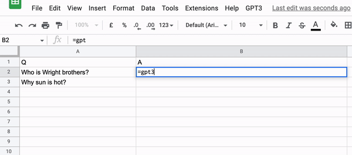

# gpt3_on_gsheet
Get GPT-3 completion on google sheet using App script

## How to setup

1. Open a new Google Sheet file
2. Extension > Appscript
3. On Project Settings, put OPENAI_API_KEY under Script Properties
4. On Editor, copy paste code on `script.js`
5. Edit `preface` and `prompt` as needed
6. Select `gpt3` as function to run and click Run

## How to use

There are two ways:

1. Use it as a custom function, e.g. `gpt3(A2)` to use A2 as input prompt
2. Block range, click menu GPT3 > Fill. This will use left most column as input and right most column as output.
